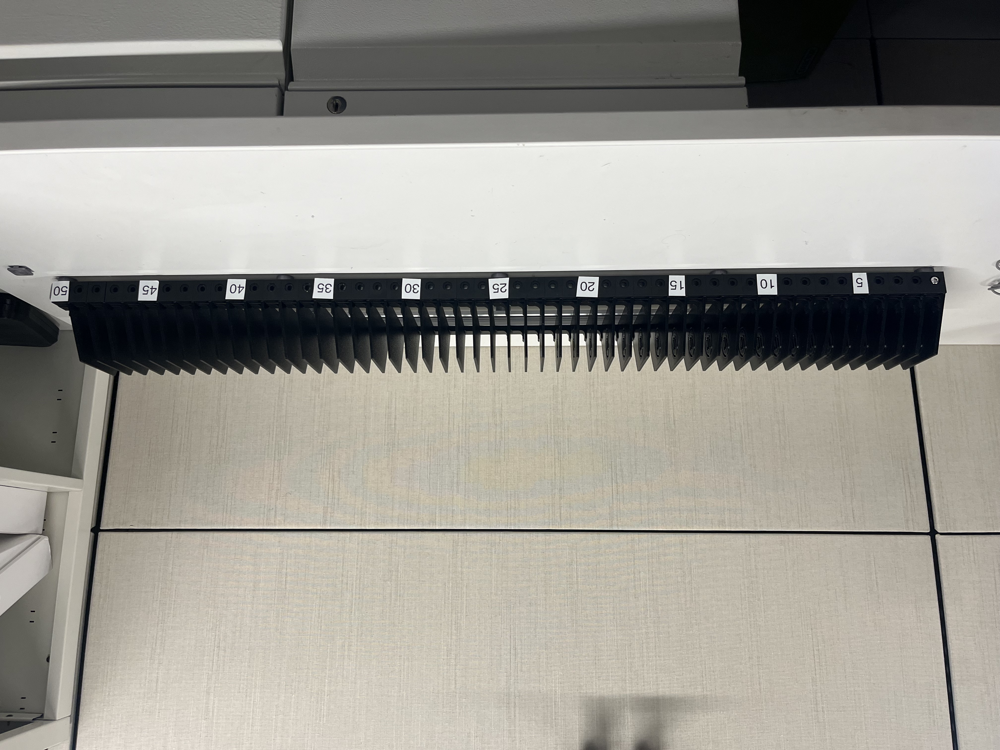
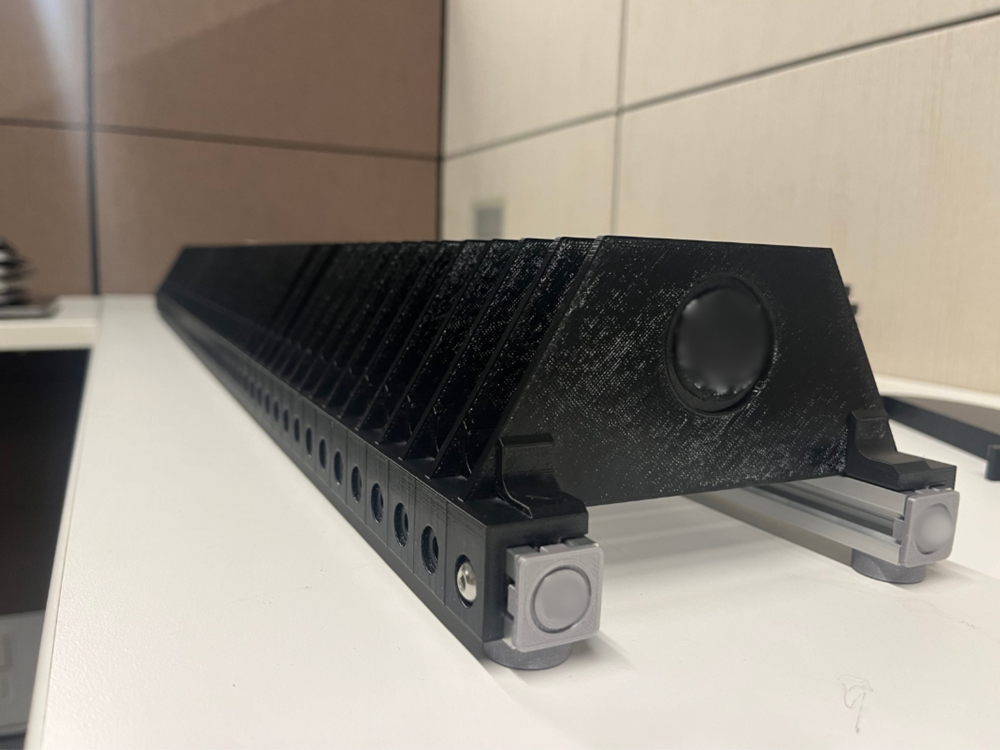
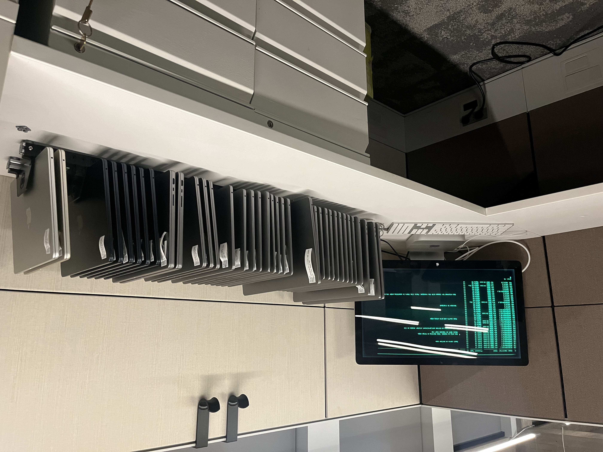

# Untangling Christmas Lights: Tips and Tricks for Managing a Hand-Me-Down Jamf Deployment
_Chad Lawson @ JNUC 2024_

In my presentation I described the scenario I encountered taking over a Jamf installation, and while I had a large hand in creating and maintaining it over the years, there were others as well. Additionally there was an 18 month window where I was out of it completely.

Going into it there were things I knew, things I knew I didn't know, and things I didn't know that I didn't now.

## The Shoulders of Giants

The key to getting out of the hole I had fallen into was by leveraging the hard work of others in the Mac and Jamf community; including, but not limited to:

* [Erase-install](https://github.com/grahampugh/erase-install) by Graham Pugh (grahampugh)
* [macdvmtool](https://github.com/AsahiLinux/macvdmtool) by Hector Martin (marcan)
* [Mist](https://github.com/ninxsoft/Mist) by Nindi Gill (ninxsoft)
* [super](https://github.com/Macjutsu/super) by Kevin White (macjutsu)
* [Prune](https://github.com/BIG-RAT/Prune) by Leslie Helou (BIG-RAT)

Additionally, Richard Purves (aka 'Franton' on MacAdmins Slack) spoke on the same idea from a different viewpoint. He provided two additional resources for my collection I wanted to share:

* [KMART - Kick Ass Mac Admin Reporting Tool](https://github.com/ninxsoft/Kmart) by ninxsoft
* [Suspicious Package](https://github.com/JamiesWhiteShirt/suspicious-package) by JamiesWhiteShirt

## My Scripts

Generally I advocate for using "proven technologies" like those above to solve problems. Having said that, my hubris[^hubris] often gets in the way.

So to help with inspecting the policies I had in place in a single view, I created a shell script called "Policy Map" to help.

It should go beyond saying that I am providing this script "as-is" with no guarantees it will keep working.


To use it, you can choose to hardcode the values in the "CONFIG" array towards the top. But it was designed to be used with command line arguments, like this:

``./Policy\ Map.sh --jamfurl 'https://YOURINSTANCE.jamfcloud.com' --jamfuser=APIUSER --jamfpass='PASSWORD'``

## DFU Refresh Workflow

For refreshing all the Apple Silicon machines, I found it significantly faster and hands-free to use DFU mode and Apple Configurator command line tools (``cfgutil``) over "Erase all Contents and Settings" or Recovery Mode.

The following are the resources I found to learn how to leverage this process:

* https://twocanoes.com/knowledge-base/mds-5-guide/
* https://www.bkurtz.io/posts/macvdmtool/
* https://support.apple.com/guide/deployment/configure-devices-dep6f70f6647/web
* https://support.apple.com/en-us/108900
* https://mrmacintosh.com/restore-macos-firmware-on-an-apple-silicon-mac-boot-to-dfu-mode/

## The Mac Rack Project
Starting on day one I sought to identify the computers that were out there but not in use. As I located all the test machines, ones returned from former employees, and computers that had been forsaken when the team member received an upgrade; I needed a way to keep track of them physically and within Jamf.

And the Mac Rack was born!

We had a 3D printer and had tinkered with aluminum extrusion for re-mounting WiFi access points, so I decided to put those tools and experience to use.






## Hardware
The physical build is pretty straight forward. There are two 1-meter lengths (though any length would work) of v-slot 20x20 linear rail as the frame. The 3D printed dividers are held in place (or at least every few of them) with M5 T-nuts and screws.

### Linear Rail and Connectors
* [20x20 V-Slot Rail](https://openbuildspartstore.com/v-slot-20x20-linear-rail) (Open Builds Parts Store)
* [T-Nuts - 150pcs](https://www.amazon.com/gp/product/B086MKNYDS/) (Amazon)
* [M5 Screws - 100pcs](https://www.amazon.com/gp/product/B07H18YDYB/) (Amazon)

### 3D Printed Files
* [Mac Rack Divider](/Mac%20Rack/STLs/Mac%20Rack%20Divider.stl)
* [Feet](/Mac%20Rack/STLs/2020%20Foot.stl)
* [2020 Endcap by 'ecking' on Printables](https://www.printables.com/model/71822-2020-endcap)

## Software
Early iterations used a couple of _Extension Attributes_ within Jamf. But I soon found a need to be able to quickly check a machine in/out when I was sitting in front of it, and I didn't want to create yet another API script and policy to do so. 

### Jamf 
But then I remembered that the _recon_ verb of the Jamf binary included a number of fields from the _User and Location_ section that I could use. So an easy way to check a machine in became:

``sudo jamf recon -room 'Mac Rack' -position 'XX'``

Where _'XX'_ was the slot in the rack. And when an employee signed into the machine for the first time, Jamf Connect would pull their information from Google and override those fields, effectively checking the machine out. But if I (or someone else on the team) needed to pull a machine for testing, they could log in with the backdoor admin account and run:

``sudo jamf recon -room 'Testing' -position '[REASON]'``

_**Side Note:** For whatever reason, entering 'false' (0, empty, or zpace) values (e.g. ``-room '0'``) results in the input being tossed and the previous values retained._

### Shortcuts
I created a series of **Shortcuts** to check machines in and out and to view what was there. There is also one that takes either the JamfID or Serial Number of a computer and pulls information about the computer to create a label to attach to the machine. Rather than duplicate the variables and token-fetching action between them, each runs one shortcut ("Config") that handles the overhead.

I've added some comments for readability and removed all the hardcoded values for security sake, but otherwise these are just as raw as they were back then. They should be considered as a starting point or for reference puposes only.


* [Config](/Mac%20Rack/shortcuts/Config.shortcut) - Open this first and fill in your details. This is used by all the others.
* [Show Mac Rack](/Mac%20Rack/shortcuts/Show%20Mac%20Rack.shortcut) - Displays a web view of all the items in the Mac Rack. Click on column header to sort by that field.
* [Check In](/Mac%20Rack/shortcuts/Check%20In.shortcut) - Asks for a JamfID[^1] and removes the computer from the Mac Rack.
* [Check Out](/Mac%20Rack/shortcuts/Check%20Out.shortcut) - Asks for a JamfID and a slot number and adds the computer to the Mac Rack in that space.
* [Get Computer Record for Label](/Mac%20Rack/shortcuts/Get%20Computer%20Record%20for%20Label.shortcut) - Designed to be used by aiming an iPhone camera at the serial number of a computer and using LiveText to share the serial to this Shortcut. Absent that shared input it asks for a serial number or JamfID. It then looks up the computer and creates a block of text with the following information and puts it in the clipboard:
```txt
ID: 19
Serial Number:F2775742JR
Model: MacBook Air (M2, 2022)
Processor Type: Apple M2
OS Version: 14.2.0
```
This could then be sent to a thermal label/receipt printer to attach to the computer for easy reference as seen in the last image above.

[^1]: Ideally I would have asked for the slot number and then done a look up of the comptuers in the Mac Rack and grabbed the JamfID from there. But I didn't feel like taking the time.
[^hubris]: Larry Wall, the creator of Perl described the three virtues of a programmer as laziness, impatience, and hubris.